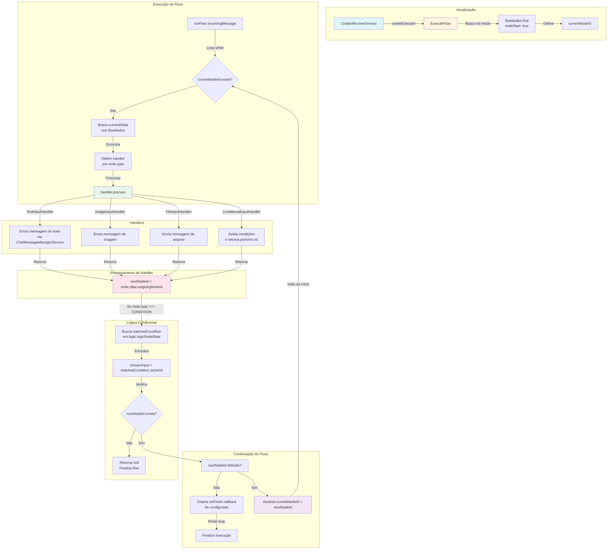
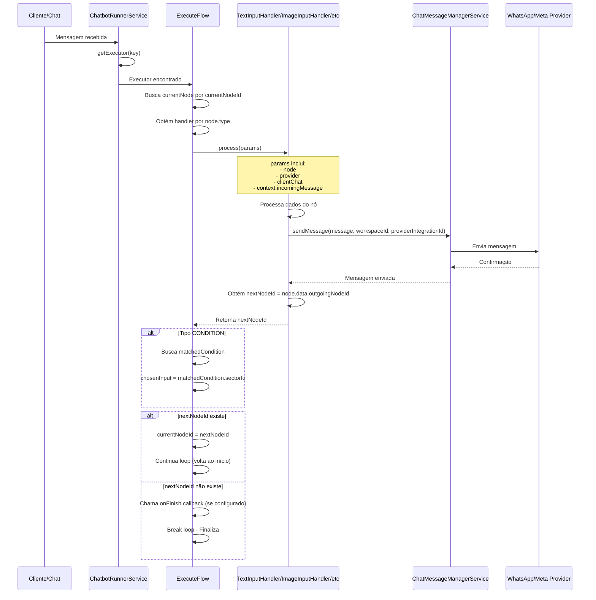
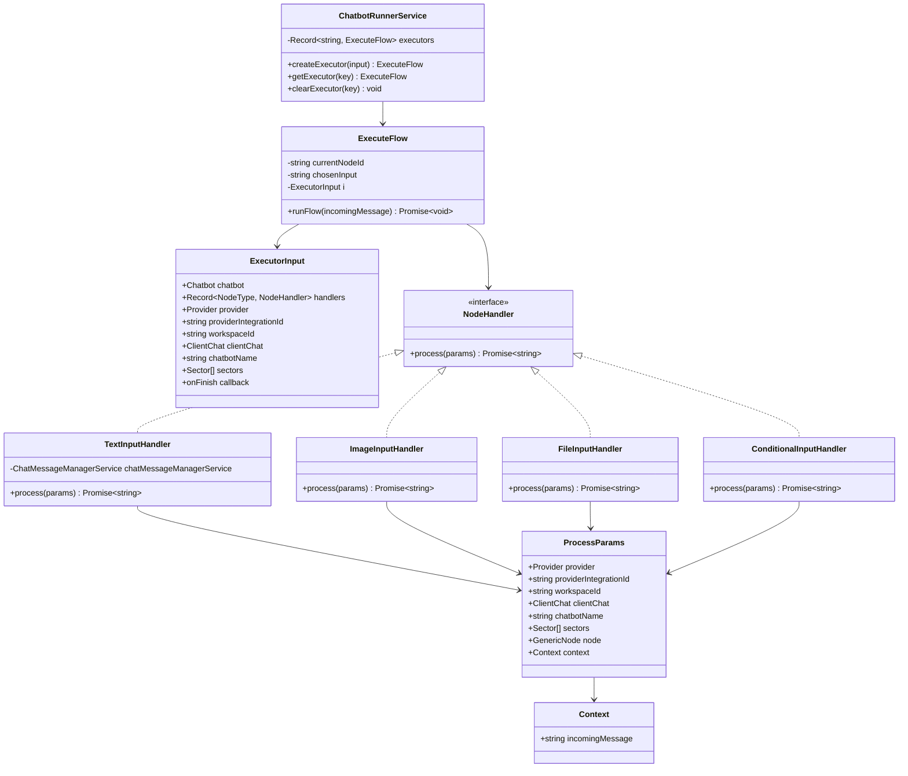
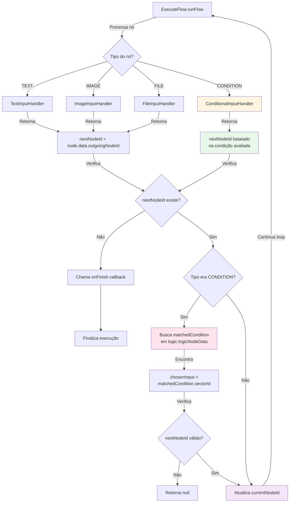
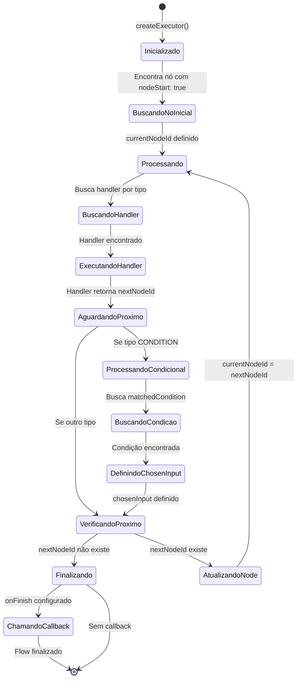

# Diagrama do Backend - Chatbot Runner Service

```mermaid
graph TB
    subgraph "Inicialização"
        A[ChatbotRunnerService] -->|createExecutor| B[ExecuteFlow]
        B -->|Busca nó inicial| C[flowNodes.find<br/>nodeStart: true]
        C -->|Define| D[currentNodeId]
    end

    subgraph "Execução do Fluxo"
        E[runFlow incomingMessage] -->|Loop while| F{currentNodeId existe?}
        F -->|Sim| G[Busca currentNode<br/>nos flowNodes]
        G -->|Encontra| H[Obtém handler<br/>por node.type]
        H -->|Processa| I[handler.process]
    end

    subgraph "Handlers"
        I -->|TextInputHandler| J[Envia mensagem de texto<br/>via ChatMessageManagerService]
        I -->|ImageInputHandler| K[Envia mensagem de imagem]
        I -->|FileInputHandler| L[Envia mensagem de arquivo]
        I -->|ConditionalInputHandler| M[Avalia condições<br/>e retorna próximo nó]
    end

    subgraph "Processamento de Handler"
        J -->|Retorna| N[nextNodeId = node.data.outgoingNodeId]
        K -->|Retorna| N
        L -->|Retorna| N
        M -->|Retorna| N
    end

    subgraph "Lógica Condicional"
        N -->|Se node.type === CONDITION| O[Busca matchedCondition<br/>em logic.logicNodeData]
        O -->|Encontra| P[chosenInput = matchedCondition.sectorId]
        P -->|Verifica| Q{nextNodeId existe?}
        Q -->|Não| R[Retorna null<br/>Finaliza flow]
    end

    subgraph "Continuação do Fluxo"
        Q -->|Sim| S[nextNodeId definido?]
        S -->|Não| T[Chama onFinish callback<br/>Se configurado]
        T -->|Break loop| U[Finaliza execução]
        S -->|Sim| V[Atualiza currentNodeId = nextNodeId]
        V -->|Volta ao início| F
    end

    style A fill:#e1f5ff
    style B fill:#fff4e1
    style I fill:#e8f5e9
    style N fill:#fce4ec
    style V fill:#f3e5f5
```

## Sequência de Execução Detalhada

```mermaid
sequenceDiagram
    participant Client as Cliente/Chat
    participant CRS as ChatbotRunnerService
    participant EF as ExecuteFlow
    participant Handler as TextInputHandler/ImageInputHandler/etc
    participant CMM as ChatMessageManagerService
    participant Provider as WhatsApp/Meta Provider

    Client->>CRS: Mensagem recebida
    CRS->>CRS: getExecutor(key)
    CRS->>EF: Executor encontrado
    
    EF->>EF: Busca currentNode por currentNodeId
    EF->>EF: Obtém handler por node.type
    
    EF->>Handler: process(params)
    Note over Handler: params inclui:<br/>- node<br/>- provider<br/>- clientChat<br/>- context.incomingMessage
    
    Handler->>Handler: Processa dados do nó
    Handler->>CMM: sendMessage(message, workspaceId, providerIntegrationId)
    CMM->>Provider: Envia mensagem
    Provider-->>CMM: Confirmação
    CMM-->>Handler: Mensagem enviada
    
    Handler->>Handler: Obtém nextNodeId = node.data.outgoingNodeId
    Handler-->>EF: Retorna nextNodeId
    
    alt Tipo CONDITION
        EF->>EF: Busca matchedCondition
        EF->>EF: chosenInput = matchedCondition.sectorId
    end
    
    alt nextNodeId existe
        EF->>EF: currentNodeId = nextNodeId
        EF->>EF: Continua loop (volta ao início)
    else nextNodeId não existe
        EF->>EF: Chama onFinish callback (se configurado)
        EF->>EF: Break loop - Finaliza
    end
```

## Estrutura de Classes e Handlers

```mermaid
classDiagram
    class ChatbotRunnerService {
        -Record~string, ExecuteFlow~ executors
        +createExecutor(input) ExecuteFlow
        +getExecutor(key) ExecuteFlow
        +clearExecutor(key) void
    }
    
    class ExecuteFlow {
        -string currentNodeId
        -string chosenInput
        -ExecutorInput i
        +runFlow(incomingMessage) Promise~void~
    }
    
    class ExecutorInput {
        +Chatbot chatbot
        +Record~NodeType, NodeHandler~ handlers
        +Provider provider
        +string providerIntegrationId
        +string workspaceId
        +ClientChat clientChat
        +string chatbotName
        +Sector[] sectors
        +onFinish callback
    }
    
    class NodeHandler {
        <<interface>>
        +process(params) Promise~string~
    }
    
    class TextInputHandler {
        -ChatMessageManagerService chatMessageManagerService
        +process(params) Promise~string~
    }
    
    class ImageInputHandler {
        +process(params) Promise~string~
    }
    
    class FileInputHandler {
        +process(params) Promise~string~
    }
    
    class ConditionalInputHandler {
        +process(params) Promise~string~
    }
    
    class ProcessParams {
        +Provider provider
        +string providerIntegrationId
        +string workspaceId
        +ClientChat clientChat
        +string chatbotName
        +Sector[] sectors
        +GenericNode node
        +Context context
    }
    
    class Context {
        +string incomingMessage
    }
    
    ChatbotRunnerService --> ExecuteFlow
    ExecuteFlow --> ExecutorInput
    ExecuteFlow --> NodeHandler
    NodeHandler <|.. TextInputHandler
    NodeHandler <|.. ImageInputHandler
    NodeHandler <|.. FileInputHandler
    NodeHandler <|.. ConditionalInputHandler
    TextInputHandler --> ProcessParams
    ImageInputHandler --> ProcessParams
    FileInputHandler --> ProcessParams
    ConditionalInputHandler --> ProcessParams
    ProcessParams --> Context
```

## Fluxo de Decisão Condicional

```mermaid
flowchart TD
    A[ExecuteFlow.runFlow] -->|Processa nó| B{Tipo do nó?}
    
    B -->|TEXT| C[TextInputHandler]
    B -->|IMAGE| D[ImageInputHandler]
    B -->|FILE| E[FileInputHandler]
    B -->|CONDITION| F[ConditionalInputHandler]
    
    C -->|Retorna| G[nextNodeId = node.data.outgoingNodeId]
    D -->|Retorna| G
    E -->|Retorna| G
    F -->|Retorna| H[nextNodeId baseado<br/>na condição avaliada]
    
    G -->|Verifica| I{nextNodeId existe?}
    H -->|Verifica| I
    
    I -->|Não| J[Chama onFinish callback]
    J --> K[Finaliza execução]
    
    I -->|Sim| L{Tipo era CONDITION?}
    L -->|Sim| M[Busca matchedCondition<br/>em logic.logicNodeData]
    M -->|Encontra| N[chosenInput =<br/>matchedCondition.sectorId]
    N -->|Verifica| O{nextNodeId válido?}
    O -->|Não| P[Retorna null]
    O -->|Sim| Q[Atualiza currentNodeId]
    
    L -->|Não| Q
    Q -->|Continua loop| A
    
    style F fill:#fff4e1
    style H fill:#e8f5e9
    style M fill:#fce4ec
    style Q fill:#f3e5f5
```

## Gerenciamento de Estado do Executor

```mermaid
stateDiagram-v2
    [*] --> Inicializado: createExecutor()
    
    Inicializado --> BuscandoNoInicial: Encontra nó com nodeStart: true
    BuscandoNoInicial --> Processando: currentNodeId definido
    
    Processando --> BuscandoHandler: Busca handler por tipo
    BuscandoHandler --> ExecutandoHandler: Handler encontrado
    ExecutandoHandler --> AguardandoProximo: Handler retorna nextNodeId
    
    AguardandoProximo --> ProcessandoCondicional: Se tipo CONDITION
    AguardandoProximo --> VerificandoProximo: Se outro tipo
    
    ProcessandoCondicional --> BuscandoCondicao: Busca matchedCondition
    BuscandoCondicao --> DefinindoChosenInput: Condição encontrada
    DefinindoChosenInput --> VerificandoProximo: chosenInput definido
    
    VerificandoProximo --> Finalizando: nextNodeId não existe
    VerificandoProximo --> AtualizandoNode: nextNodeId existe
    
    AtualizandoNode --> Processando: currentNodeId = nextNodeId
    
    Finalizando --> ChamandoCallback: onFinish configurado
    ChamandoCallback --> [*]: Flow finalizado
    Finalizando --> [*]: Sem callback
```

