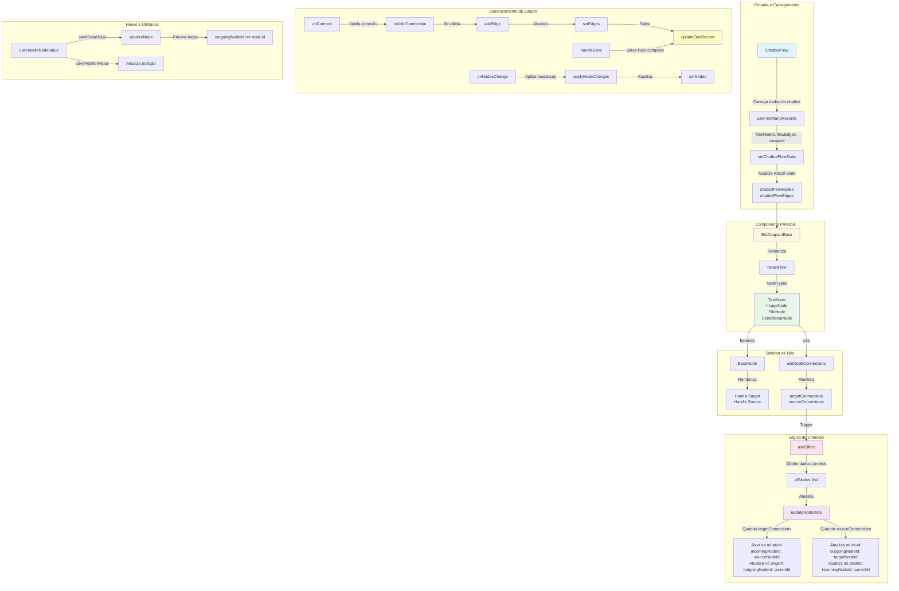
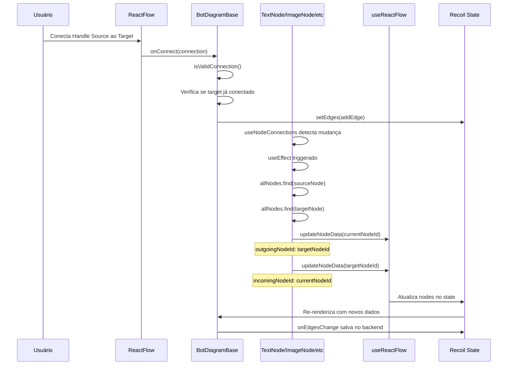
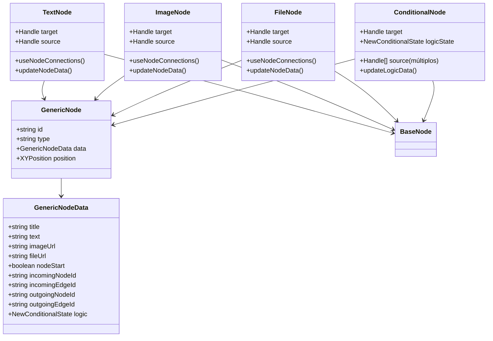

# Diagrama do Frontend - Sistema de Nós do Chatbot

```mermaid
graph TB
    subgraph "Entrada e Carregamento"
        A[ChatbotFlow] -->|Carrega dados do chatbot| B[useFindManyRecords]
        B -->|flowNodes, flowEdges, viewport| C[setChatbotFlowState]
        C -->|Atualiza Recoil State| D[chatbotFlowNodes<br/>chatbotFlowEdges]
    end

    subgraph "Componente Principal"
        D --> E[BotDiagramBase]
        E -->|Renderiza| F[ReactFlow]
        F -->|NodeTypes| G[TextNode<br/>ImageNode<br/>FileNode<br/>ConditionalNode]
    end

    subgraph "Sistema de Nós"
        G -->|Estende| H[BaseNode]
        H -->|Renderiza| I[Handle Target<br/>Handle Source]
        
        G -->|Usa| J[useNodeConnections]
        J -->|Monitora| K[targetConnections<br/>sourceConnections]
    end

    subgraph "Lógica de Conexão"
        K -->|Trigger| L[useEffect]
        L -->|Obtém dados corretos| M[allNodes.find]
        M -->|Atualiza| N[updateNodeData]
        
        N -->|Quando targetConnections| O[Atualiza nó atual:<br/>incomingNodeId: sourceNodeId<br/>Atualiza nó origem:<br/>outgoingNodeId: currentId]
        
        N -->|Quando sourceConnections| P[Atualiza nó atual:<br/>outgoingNodeId: targetNodeId<br/>Atualiza nó destino:<br/>incomingNodeId: currentId]
    end

    subgraph "Gerenciamento de Estado"
        Q[onConnect] -->|Valida conexão| R[isValidConnection]
        R -->|Se válida| S[addEdge]
        S -->|Atualiza| T[setEdges]
        T -->|Salva| U[updateOneRecord]
        
        V[onNodesChange] -->|Aplica mudanças| W[applyNodeChanges]
        W -->|Atualiza| X[setNodes]
        
        Y[handleSave] -->|Salva fluxo completo| U
    end

    subgraph "Hooks e Utilitários"
        Z[useHandleNodeValue] -->|saveDataValue| AA[sanitizeNode]
        AA -->|Previne loops| AB[outgoingNodeId !== node.id]
        Z -->|savePositionValue| AC[Atualiza posição]
    end

    style A fill:#e1f5ff
    style E fill:#fff4e1
    style G fill:#e8f5e9
    style L fill:#fce4ec
    style N fill:#f3e5f5
    style U fill:#fff9c4
```

## Fluxo de Conexão de Nós

```mermaid
sequenceDiagram
    participant User as Usuário
    participant RF as ReactFlow
    participant BN as BotDiagramBase
    participant Node as TextNode/ImageNode/etc
    participant ReactFlow as useReactFlow
    participant State as Recoil State

    User->>RF: Conecta Handle Source ao Target
    RF->>BN: onConnect(connection)
    BN->>BN: isValidConnection()
    BN->>BN: Verifica se target já conectado
    BN->>State: setEdges(addEdge)
    
    Node->>Node: useNodeConnections detecta mudança
    Node->>Node: useEffect triggerado
    Node->>Node: allNodes.find(sourceNode)
    Node->>Node: allNodes.find(targetNode)
    
    Node->>ReactFlow: updateNodeData(currentNodeId)
    Note over Node: outgoingNodeId: targetNodeId
    
    Node->>ReactFlow: updateNodeData(targetNodeId)
    Note over Node: incomingNodeId: currentNodeId
    
    ReactFlow->>State: Atualiza nodes no state
    State->>BN: Re-renderiza com novos dados
    BN->>State: onEdgesChange salva no backend
```

## Estrutura de Dados dos Nós

```mermaid
classDiagram
    class GenericNode {
        +string id
        +string type
        +GenericNodeData data
        +XYPosition position
    }
    
    class GenericNodeData {
        +string title
        +string text
        +string imageUrl
        +string fileUrl
        +boolean nodeStart
        +string incomingNodeId
        +string incomingEdgeId
        +string outgoingNodeId
        +string outgoingEdgeId
        +NewConditionalState logic
    }
    
    class TextNode {
        +Handle target
        +Handle source
        +useNodeConnections()
        +updateNodeData()
    }
    
    class ImageNode {
        +Handle target
        +Handle source
        +useNodeConnections()
        +updateNodeData()
    }
    
    class FileNode {
        +Handle target
        +Handle source
        +useNodeConnections()
        +updateNodeData()
    }
    
    class ConditionalNode {
        +Handle target
        +Handle[] source (múltiplos)
        +NewConditionalState logicState
        +updateLogicData()
    }
    
    GenericNode --> GenericNodeData
    TextNode --> GenericNode
    ImageNode --> GenericNode
    FileNode --> GenericNode
    ConditionalNode --> GenericNode
    TextNode --> BaseNode
    ImageNode --> BaseNode
    FileNode --> BaseNode
    ConditionalNode --> BaseNode
```

